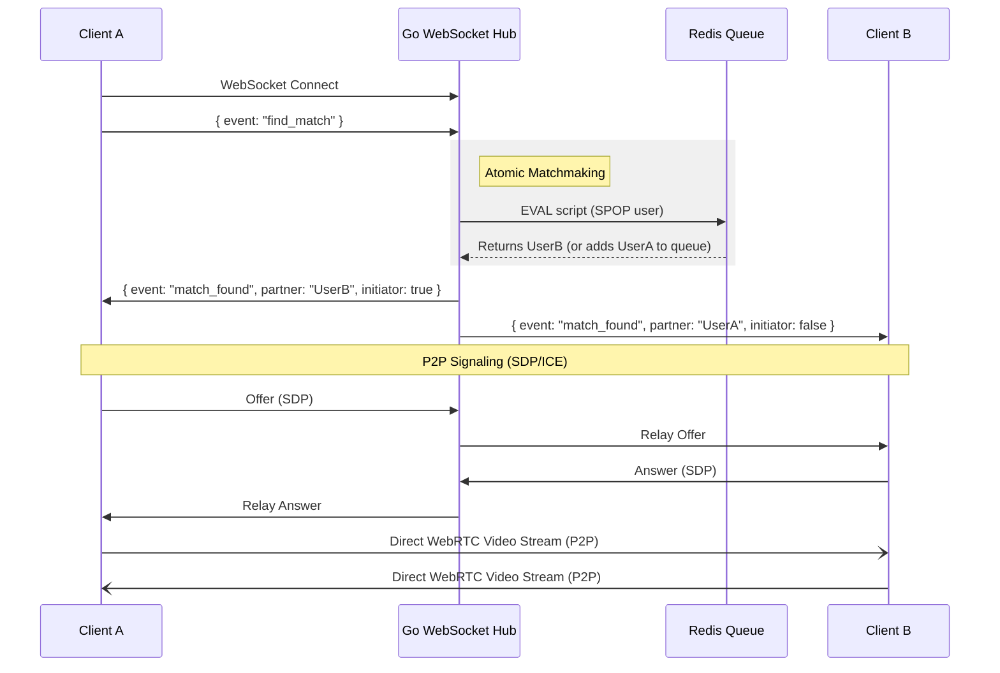

# Go-Megle (Omegle Clone)


A high-performance, real-time video chat application built with **Go (Golang)** and **WebRTC**.

This project implements a scalable **1-on-1 matchmaking engine** capable of handling high concurrency using **Redis Lua scripts** for atomic queue management and **Goroutines** for non-blocking WebSocket signaling.

---

## 🏗 Architecture

The system uses a **Peer-to-Peer (P2P)** architecture for media streaming to minimize server bandwidth costs, while using a centralized Go server for signaling and matchmaking.



## 🚀 Key Features

*   **Atomic Matchmaking:** Uses custom Redis Lua scripts to ensure O(1) matching complexity and prevent race conditions (e.g., two users grabbing the same partner simultaneously).
*   **Cross-Instance Coordination:** Redis persistence and Pub/Sub enable horizontal scaling across multiple server instances while maintaining match state consistency.
*   **WebRTC Signaling:** Full implementation of the Offer/Answer/ICE Candidate exchange via WebSockets with cross-instance relay support.
*   **Concurrency:** Leverages Go's Goroutines and Channels to handle thousands of concurrent WebSocket connections with minimal memory footprint.
*   **Zero-Persistence:** Designed for anonymity; no user data is stored on disk. Match metadata expires after 10 minutes via Redis TTL.
*   **Graceful Handling:** Handles user disconnections and "Skip" actions by cleaning up Redis Sets and notifying partners across all instances immediately.

---

## 🛠 Tech Stack

*   **Backend:** Go (Golang), Gorilla WebSockets
*   **Database:** Redis (Sets, Lua Scripting, Pub/Sub, Hash persistence with TTL)
*   **Frontend:** React, Vite, WebRTC API
*   **Infrastructure:** Docker, Docker Compose

---

## 🧠 Engineering Decisions

### 1. Why Redis Sets over Lists?
While a List (FIFO) seems intuitive for a queue, it makes random removal difficult (O(N)) if a user disconnects while waiting.
*   **Decision:** I used **Redis Sets**.
*   **Benefit:** Allows for `SPOP` (Random Pop) which distributes matches fairly and prevents "head-of-line blocking" if the first user in the queue is unresponsive.

### 2. Solving the "Double Booking" Race Condition
In a naive implementation, if User A and User B request a match simultaneously, they might both be assigned the same available User C.
*   **Solution:** I implemented the matching logic inside a **Lua Script**.
*   **Impact:** Redis guarantees that Lua scripts are executed atomically. The "Check Queue -> Pop User -> Return ID" operation happens in a single, isolated step, making race conditions impossible.

### 3. Go vs. Node.js
*   **Decision:** Go was chosen for the Signaling Server.
*   **Reasoning:** While Node.js is excellent for I/O, Go's **Goroutines** allow us to handle each WebSocket connection in a lightweight thread (approx 2KB stack size). This allows vertical scaling to tens of thousands of connections on a single instance before needing to shard.

### 4. Horizontal Scaling with Redis Persistence & Pub/Sub
*   **Challenge:** When deploying multiple server instances behind a load balancer, clients in a match may be connected to different servers.
*   **Solution:** 
  - **Match Persistence:** Active matches are stored in Redis as Hashes (`match:<id>`) with a 10-minute TTL to survive instance restarts and enable cross-instance lookups.
  - **Pub/Sub Signaling:** WebRTC signals (SDP offers/answers, ICE candidates) are published to a Redis channel (`signals`) so any instance can relay messages to the correct client.
  - **Disconnect Handling:** When a client disconnects, the server checks both in-memory state and Redis to notify the partner, even if they're on a different instance.
*   **Impact:** The system can now scale horizontally without losing match state or breaking active video sessions during deployments.

---

## ⚡ Getting Started

### Prerequisites

- Go 1.21+ (recommended)
- Node.js + npm (for frontend dev/build)
- Docker & Docker Compose (optional — for running Redis locally)

### Quick demo (recommended)

This flow builds the frontend and runs the app with Docker Compose (Redis + app container).

```bash
cd /path/to/repo
cd web
npm ci
npm run build      # produces web/dist
cd ..
docker-compose up --build
```

After the compose stack starts, open http://localhost:8080 in two tabs and click Start/Next on both.

### Local development (fast feedback)

Run the Go server and Vite dev server concurrently for fast frontend HMR.

Option A — single command (requires root npm install to get `concurrently`):

```bash
cd /path/to/repo
npm install        # installs concurrently at repo root
npm run dev        # runs `go run .` and `cd web && npm run dev`
```

Option B — two terminals (manual but explicit):

Terminal 1 (server):
```bash
cd /path/to/repo
go run .
```

Terminal 2 (frontend):
```bash
cd /path/to/repo/web
npm ci
npm run dev
```

When using the Vite dev server, open the Vite URL (shown in the terminal, e.g. http://localhost:5173) to use the dev frontend. Note that for the WebSocket connection to work during development, you might need to configure a proxy in `vite.config.js` or ensure the backend URL is correctly pointed to `localhost:8080`. The current implementation assumes `window.location.host` which works best when served by the Go server or when proxied.

### Run server only (after building frontend)

If you prefer to build the frontend and run only the Go server (no Docker):

```bash
cd /path/to/repo/web
npm ci
npm run build
cd ..
go run .
```

Open http://localhost:8080 to access the built frontend served by the Go server.

---

## 🔮 Future Improvements

*   **TURN Server Integration:** Currently uses public STUN servers. For production, I would deploy a Coturn instance to handle symmetric NAT traversal.
*   **Horizontal Scaling:** Replace the in-memory `Hub` struct with **Redis Pub/Sub** to allow WebSocket connections to be distributed across multiple Go server instances.
*   **Moderation Pipeline:** Integrate a background worker to sample video frames and send them to a Computer Vision API (e.g., AWS Rekognition) for NSFW detection.

---

## 📄 License
MIT Public License